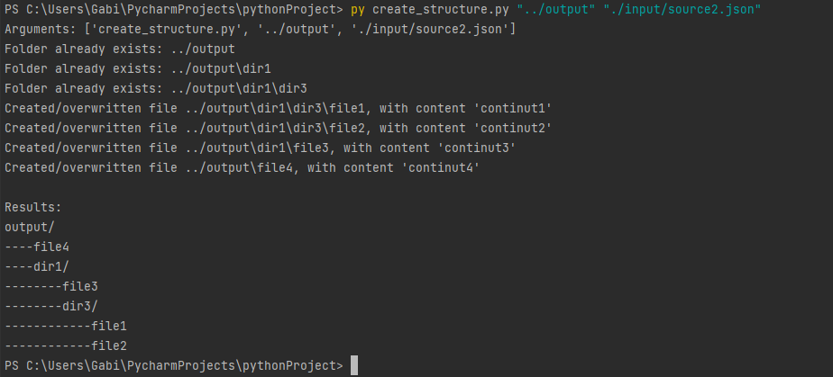

## _Python Programming 2021_
[](https://www.info.uaic.ro/)

Diac P. Gabriel
3A2

### Name: Generate structure | ID:6 
### Difficulty: B 
### Propose: TDY

#### 1. Cerinta

Creati un script care primeste de la linia de comanda un path catre un director si un fisier
JSON. In fisierul JSON se afla un dictionar in care se afla o structura de directoare si fisiere
astfel: fiecare cheie care are ca valoare un dictionar este un director iar dictionarul contintul,
iar fiecare cheie care are ca valoare un string reprezinta un fisier iar string-ul respectiv este
continutul fisierului. Scriptul va crea in folderul dat ca argument directoarele si fisierele
conform dictionarului din JSON.

INPUT: create_structure.py root_folder_path structure_json_file_path

Exemplu de dictionar:

{"dir1" : {"dir2": {"file1": "continut1", "file2": "continut2"}, "file3": "continut3"}, "file4": "continut4"}

OUTPUT:
````
root_folder
---dir1
------dir2
---------file1: continut1
---------file2: continut2
------file3: continut3
---file4: continut4
````


2. Executie 

Fisierul `main.py` contine functionalitatea propriu-zisa si este apelata IDE cu date de a test hardcodate, cu scopul de testa aplicatia. Pentru asta au fost adaugate niste fisiere de input, la _/input/source{n}_.
````
# run from pycharm for testing
if __name__ == '__main__':
    try:
        main("./output", "./input/source2.json")
    except Exception as e:
        print(e)
````

In acelasi timp, pentru a respecta cerinta, un fisier `create_structure.py` a fost creat pentru a face apel la functionalitatea din `main.py`, cu date dinamice ca input, in maniera specificata in cerinta:

````
create_structure.py root_folder_path structure_json_file_path
````

Exemplu output:



3. Mentiuni

Comportamentul programului atunci cand gaseste un folder existent e sa-l pastreze si sa adauge sau suprascrie fisiere in functie de _structure_json_file_path_. Deci fisierele care existau inainte de rulare si care nu au fost suprascrise de program (conform input-ului) raman neschimbate.